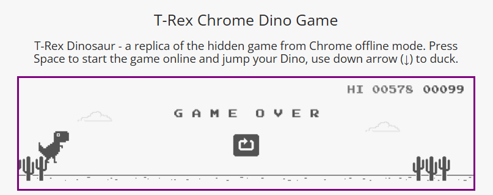

# Chrome dinosaur game



Go to https://chromedino.com/

The following userstyle is used to make the bot detect the game area correctly:

```css
.runner-canvas {
    border: solid purple 3px;
    box-sizing: border-box;
}
```

Small amounts of training data is needed, about 3000 images should be enough to show the concept. Does not perform particularly well.
